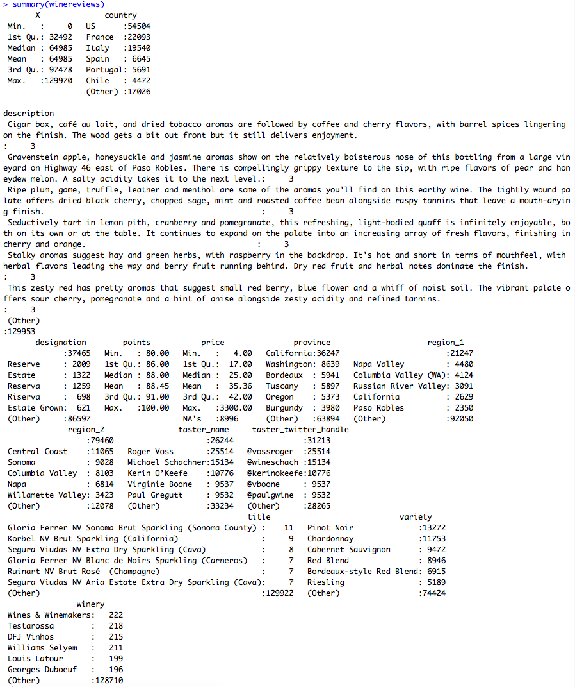
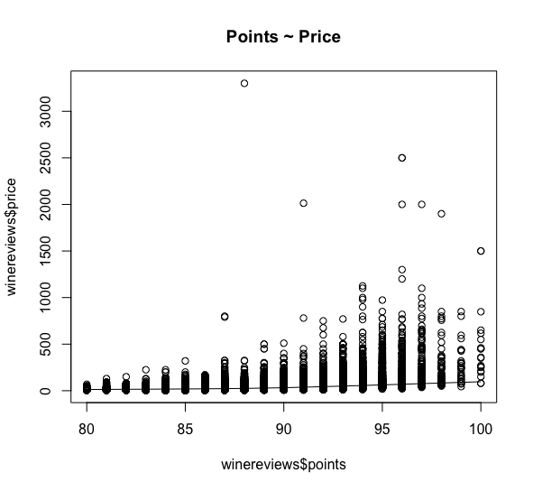
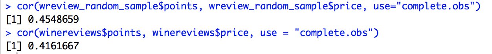
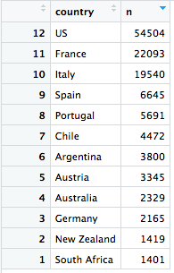
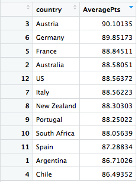

# Analysis of Wine Ratings on Wine Enthusiast (Rough Draft)
#### Written by Kyle Peeler

## Introduction
This semester I am in my senior year and was in desperate need of a cultural understanding class to graduate, so I decided to take Wines of the World. Previous to this class I would call myself a beer guy, but this class has helped me to not only learn a ton about wine, but also discover a new alcohol beverage preference. With my new-found love of tasting different kinds of wine, [I came across a cool data set](https://www.kaggle.com/zynicide/wine-reviews) comprised of ratings from [WineEnthusiast.com](http://www.WineEnthusiast.com) and thought I'd use my data science skills to see what I could learn about different kinds of wine. Using this data, I posed 3 few questions for myself to analyze: How does price of wine relate to the points awarded? What countries make the best wine? What words are most used in reviews for higher scoring/lower scoring wines? 

## The Data Set
While I have seen a few other articles [analyze wine from other sources such as Vivino](https://nycdatascience.com/blog/student-works/web-scraping-analysis-wines-vivino-com/), this data set is the first I have seen using WineEnthusiast's data. This data set includes about 130,000 rows of data, one for each different kind of wine reviewed by WineEnthusiast. The data includes the points rated on WineEnthusiast's scale of 1-100, the title of the wine, the varietal of the wine (this is the type of grape used ie Pinot Noir), the description given by WineEnthusiast, the country of origin, the province and region(s) within the country of origin where the wine's grapes are grown, the winery, the price, and the taster's name. For some introductory analysis, here is a summary of the data we will be analyzing (in my opinion the most interesting here is the average price among 130,000 wines… about $25):

 
## How does price of wine relate to points awarded?
One thing that I have come to learn is that a "good" bottle of wine does not always have to cost a lot of money. Maybe this is because I have not developed a very palette… but never the less maybe price isn't a good indicator of a quality wine. To find this out, I decided to plot the price vs rating and see whether there is any correlation:

Here we are plotting all 130,000 reviews with their points vs price. With 130,000 data points, their is a ton of data to process (and thus hard to generate a responsive interactive chart) and the outliers skew the graph somewhat. I have decided to randomly sample 10,000 wine reviews while removing outliers (price < $1400) to further analyze the relationship using an interactive plot.

<iframe src="file:///Users/kyle/School/CS490/wine-blog-post/interactive-points-vs-price.html" width=580 height=580></iframe>

As we can see by the plot and the regression line there does not suggest a strong correlation between points and price. Thus, you don't have to be rich to try great wine (maybe part of the reason I started liking wine so much as a poor college student?). This is further confirmed by running the correlation function in R, with a result that is less than .5 for both the entire data set and the sample, suggesting price is not strongly related to the associated rating.

 
## What countries make the best wine?
Next, I wanted to analyze which countries make the best wine. I choose this because as the class title (Wines of the World) may suggest, the course is organized by learning about wines of different countries. So far in class we have learned about wines in the United States, and the Southern Hemisphere (Chile, Argentina, Australia, New Zealand, and South Africa) and are just beginning to learn about European wines. I wanted to see if we had already covered the "best" wines according to WineEnthusiast, or if the best were still to come. I hypothesize that European wines will be the most favorited as they have a much longer history of wine making than the United States. To determine this, I first selected the top countries Wine Enthusiast reviewed by filtering out all countries that had less than 1000 reviews (otherwise a low number of reviews would have skewed the results).  These top countries were as follows:

 

Using these top countries, we used the aggregate function to average all points awarded to these top countries and sorted them by the average points to find the best countries for wine (see right). My hypothesis here was correct as European wines on average scored higher than US wines, however surprisingly Austria was the highest scoring country. Turns out the best is still to come!

## What words are most used in reviews for higher and lower scoring wines?
In order to find the highest and lowest scoring wines, I found the top and bottom 20% based on the point value assigned to the wines. From here, I want to analyze what the most frequent words are used in the descriptions to try and obtain a picture of what the most descriptive words are for the best and not-so-good wines that were reviewed by WineEnthusiast. I will also use LDA analysis for each set of descriptions to try and obtain the top keywords in each topic generated by the sets of descriptions. I hypothesize mostly positive words will be used in the top 20% and mostly negative words will be used in the bottom 20%.

